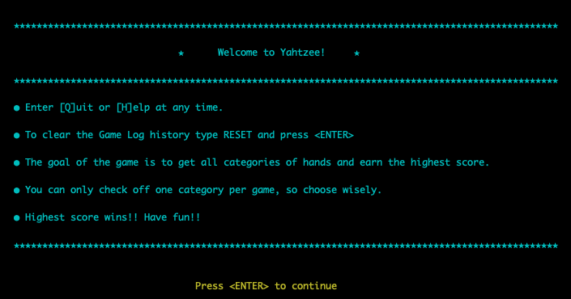

# Yahtzee!      
### Benjamin Campbell • Assignment T1A3 • May 11, 2023


## Project Links:
- [Github Repository](https://github.com/bccbass/T1A3-src)
- [Project Management (Trello)](https://trello.com/b/LXnmqhk8/terminal-app)

  

## Code Style Guide: 
The code adheres to [Python PEP 8](https://peps.python.org/pep-0008/) conventions with the following caveats and specifications:
- ```tab``` indentation is utilized over ```spaces```
- 'Kebab-case' is used for file names with multiple words

## Features:
- ### Dice
     The dice should be seamlessly intertwined with gameplay. They should be random and easy to navigate and interpret. Each turn is comprised of three rounds of dice roll. At each roll the play can select which dice to keep, which to roll again. There is also the option to end turn early (eg. after the first roll if it's a keeper). The gameplay is very similar to a round of poker with discards, hence I will be referring to the collection of 5 dice values as a hand throughout the project. Crafting this functionality will require a minimum of two parts: The logic and strategy for dice functionality and then integrating how the user interacts and manipulates dice throws.
 

- ### CLI User Interface:
    CLI user interface controls the flow of the entire game and interaction between program and user. The aim is to make it fun and easy with as little barrier for play to the user as possible. Game should flow easily between rounds and turns. It should add and log categories seamlessly. It should have a clean and graceful finish by showing game history and score comparison, wish a congratulations and give option to play again or exit the app. Validation/exception handling will be imperative to ensure a smooth user experience.

- ### Game History Storage:
    Logging game history for integration into gameplay is helpful to create a more personalized UX, it helps craft challenges and goals to give context and hopefully garner excitement. This functionality serves to remind user of their previous hight score and provides a personal and global ‘score to beat’. It helps to welcome back a return user or make an initial welcome statement to a new user.

- ### Lower Half Of Card:
    Lower half of card refers to the categories that can be checked off in a hand. Each category can only be claimed once, with the exception of Yahtzee which has no bounds, and increasing point value for each subsequent yahtzee rolled. The lower half of the card includes the following categories:
    - 3 of a kind
    - 4 of a kind
    - Full House
    - Sm Straight
    - Lg Straight
    - Chance
    - Yahtzee*
    
        **Yahtzee is the only category that can have multiple entries*
    
    This section requires logic to validate what categories a given hand falls into, and crafting interface between user and program to navigate choosing a hand and handling exceptions if a user tries to add to category while lacking the correct hand. Testing, exception handling and UI/UX are imperative for this section.

- ### UX: 
    The UX should be easygoing and strive for a smooth flow. These concerns include mild graphical presentation, prompts, informational tables, a graphical representation of dice and game navigation.

## Implementation Plan:
Planning and implementing the approach and execution was of paramount importance for the project. In the initial stages high level overviews of key features were utilized to help map the technical needs of implementation ([gameflow](./docs/gameflow.md),   [project file structure](./docs/project-file-structure.md)). A KANBAN approach was implemented and aided by a [Trello Board](https://trello.com/b/LXnmqhk8/terminal-app) to outline features and tasks, assign due dates and oversee development:

- ### Initial Features on Trello Board:


Features each contained a list of actions necessary for implemenation and the overall feature had a due date attached.

- ### Overview of Trello:


In addition to the Features and their corresponding actions, a to-do list of more general needs was created in the first stages as well. Each item contained a card with details for implemention as well as a due date to ensure smooth preject flow. 

- ### Trello Resources:


The board also had sections to keep track of ideas for modules, approaches and early stages of planning. A glossary was created to log and develop naming conventions to be used within the app. 

- ### First Progress Update:

    
- ### Second Progress Update:


Second update. Note a Bugs to Fix section was added to keep track of the many snags encountered in development.

- ### Third Progress Update:


At this stage from May 10, 2023 all of the main features have been implemented and there is a working game that is very close to the MVP outlined in the [initial project proposal](./docs/initial-project-proposal.md). 


## Help Documentation:

### **System requirements:**
- Any computer capable of running Python 3.10 or higher
- Python 3.10 or higher installed on the machine
- Any Terminal application with a minimum view width of 110 columns

**********
### Setup configuration and Gameplay:  


1. **Check Python Install Status**: In order to run Yahtzee Python 3.10 or higher must be installed.

    To check if Python is installed locally and verify current version:
    ```
    python --version
    ```
    This should return a message that looks like this:
    ```
    Python 3.11.3
    ```  
    If Python is not installed or is older lower than 3.10 please vist Python's [download page](https://www.python.org/downloads/) for more information including download access and installation instructions.  

    https://www.python.org/downloads/  


2. **Download and Install Yahtzee**: To install and play Yahtzee download the src directory directly from GitHub or locate it in the project directory after unzipping BenjaminCampbell_T1A3.zip.

3. **Play Yahtzee**: 
     Open a new Terminal window and navigate to the src folder. This navigation is different depending on where a folder is located in the users home directory, however the navigation commands may look something like this:
    ```
     cd user/downloads/BenjaminCampbell_T1A3/src
    ```

    From ```src``` directory in any terminal window enter:
    ```
    ./yahtzee.sh
    ```
    This command will activate a virtual environment, install the required dependencies and run the program in python.

4. **Play Yahtzee**: Game play is straightforward with clearly written prompts. Type ```[Q]uit``` or ```[H]elp``` at anytime throughout the program to exit or query a help card with game instructions.

     To clear the stored game history type ```RESET``` at anypoint in the game. Alternately one can run ```./clear-score-log.sh``` from the ```src``` directory in the terminal window for the same results. 

     
******

### Required dependencies:
```
colorama==0.4.6
iniconfig==2.0.0
packaging==23.1
pluggy==1.0.0
pyfiglet==0.8.post1
pytest==7.3.1
```
