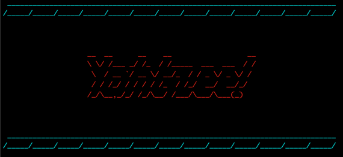

# Yahtzee!

##### Benjamin Campbell • Assignment T1A3 • May 11, 2023  

</br>

## Project Links:
- [Github Repository](https://github.com/bccbass/T1A3-src)
- [Project Management (Trello)](https://trello.com/b/LXnmqhk8/terminal-app)

  
</br>

## Code Style Guide: 
The code adheres to [Python PEP 8](https://peps.python.org/pep-0008/) conventions with the following caveats and specifications:
- ```tab``` indentation is utilized over ```spaces```
- 'Kebab-case' is used for file names with multiple words
- Both OOP and functional programming approaches were taken with a concerted effort to keep code both readable and DRY.

</br>

## Features:
- ### Dice
     The dice are intrinsically intertwined with gameplay. They are meant to be random and easy to navigate and interpret. Each turn is comprised of three rounds of dice rolling. In each round the player can select which dice to keep and which to roll again. There is also an option to end the turn early (eg. after the first roll if it's a keeper). Gameplay is very similar to a round of poker with discards, hence each collection of 5 dice values will be referred to as a hand throughout the project. Crafting this functionality required two main parts: The logic and strategy for dice functionality and the integration of how the user interacts and manipulates dice throws.
 

- ### CLI User Interface:
    CLI user interface controls the flow of the entire game and interaction between program and user. The aim was to make it fun and easy with as little barrier for gameplay as possible. The game aims to flow easily between rounds and turns. For every round the program logs and displays the updated score card. The wrap-up sequence strives to present a clean and graceful finish by showing individual game standing and all time champions, presenting corresponding messages to outcomes and offering the option to play again or exit the app. Validation and exception handling was imperative to ensuring a smooth user experience.

- ### Game History Storage:
    Logging each players game history is helpful to create engagement, statefulness and a more personalized UX. It helps craft challenges and goals to give context and hopefully garner excitement. This functionality serves to alert users of new high scores and provides a global ‘score to beat’ in the form of an 'All Time Champions' table. It also allows personalized 'welcome back' messages for return users and initial welcome statements for new users.

- ### Lower Section Of Card:
    The original Yahtzee card is comprised of an upper section and a lower section:

    

    In the project the term Card refers to this table. Each category can only be claimed once, with the exception of Yahtzee which has no limits and increased point value for each subsequent yahtzee rolled. The lower half of the card includes the following categories:
    - 3 of a kind
    - 4 of a kind
    - Full House
    - Sm Straight
    - Lg Straight
    - Chance
    - Yahtzee*
    
        **Yahtzee is the only category that can have multiple entries*
    
    This feature section implements logic to validate what categories a given hand falls into, and provides an interface between user and program to navigate choosing a hand. A Test Driven Development approach was taken when creating category checking algorithms, with tests being written prior to functions. Extensive tests for checking algorithms were implemented using PyTest. 

- ### UX: 
    The overall user experience (or UX) aimed to be easygoing, striving for a smooth flow. This necessitated implementation of mild graphical presentation, clear prompts and navigation, informational tables for player card, champion board and help section, and most importantly a graphical representation of a hand of dice. The hand of dice were designed using ASCII characters and implementation drew heavily from a [tutorial by the unfortunately named 'Bro Code'](https://www.youtube.com/watch?v=x-Ag2_bJ40Y). 

</br>

## Implementation Plan:
Planning and implementing an approach to execution was of paramount importance for the project. In the initial stages high level overviews of key features were utilized to help map the technical needs of implementation ([gameflow](./docs/gameflow.md),   [project file structure](./docs/project-file-structure.md)). A KANBAN approach was implemented and aided by a [Trello Board](https://trello.com/b/LXnmqhk8/terminal-app) to outline features and tasks, assign due dates and oversee development:

- ### Overview of Initial Trello:


The trello layout contained a card for Features, General To-Do's, Doing, and Done. Each card has a back with more details for development. Due dates were added after a project schedule was ascertained in order to ensure smooth project flow. 

- ### Initial Features on Trello Board:


Features each contained a list of actions necessary for implementation. A schedule was conceived with due dates attached to some features, however most due dates were associated with items on the general to-do list(Trello does not provide individual due dates for list items without premium membership). This was not the most elegant approach with regard to feature due dates and has been noted for future project management approach.

 

- ### Trello Resources:


The board also had sections to keep track of ideas for modules, approaches and early stages of planning. A glossary was created to log and develop naming conventions to be used within the app. 

- ### First Progress Update:

    
- ### Second Progress Update:


Second update. Note a Bugs to Fix section was added to keep track of the many snags encountered in development.

- ### Third Progress Update:


At this stage from May 10, 2023 all of the main features have been implemented and there is a working game that is very close to the MVP outlined in the [initial project proposal](./docs/initial-project-proposal.md). 

</br>


## Testing and error handling:
Error handling was of highest concern to ensure smooth and enjoyable game experience. Input error handling was implemented primarily by checking inputs for unexpected values and handling accordingly. Both try/except and conditional logic were used to safeguard against errors and unwanted game behaviour as well as to alert user of incorrect entries. Testing was carried out using both PyTest and a range of manual testing. Additional logic was implemented to check for the correct version of Python (3.10 or higher) as well as handling a missing or corrupted score-log.json file.  

PyTest lent itself to the more algorithmic functions to decipher hands as well as some of the input validating functions. Manual testing was helpful to assess unexpected inputs and overall gameflow and UX/UI. Formal manual testing resulted in a refactoring of input parsing approach in order to account for global commands of ```[Q]uit```, ```[H]elp```, and ```[R]eset``` more gracefully. PyTests can be found found in the test_card.py and test_funcs.py files and can be run in the terminal by entering PyTest from the src directory. Manual test results:
### Manual Test 1
 
### Manual Test 2
.

</br>


## Help Documentation:
### **Recommended Hardware Requirements:***
- Modern Operating System:
    - Windows 7 or 10
    - Mac OS X 10.11 or higher, 64-bit
    - Linux: RHEL 6/7, 64-bit (almost all libraries also work in Ubuntu)
- x86 64-bit CPU (Intel / AMD architecture). ARM CPUs are not supported.
- 4 GB RAM
- 5 GB free disk space
##### [*Entought](https://support.enthought.com/hc/en-us/articles/204273874-Enthought-Python-Minimum-Hardware-Requirements)

### **Software Requirements:**
- Python 3.10 or higher
- Any Terminal application with a minimum view width of 110 columns

**********
### *Installation and Gameplay:  


1. **Check Python Install Status**: Python 3.10 or higher must be installed to run Yahtzee.

    To check if Python is installed locally and verify current version open a new terminal window and enter:
    ```
    python --version
    ```
    This should return a message that looks like this:
    ```
    Python 3.11.3
    ```  
    If Python is not installed or version is lower than 3.10 please visit Python's [download page](https://www.python.org/downloads/) for more information including download access and installation instructions.  

    https://www.python.org/downloads/  


2. **Download and Install Yahtzee**: 
    - Navigate to the [Github Repository](https://github.com/bccbass/T1A3-src)
    - Locate the Code tab in the repository and select 'Download ZIP':

        


    - Alternatively you can click the download link [here](https://github.com/bccbass/T1A3-src/archive/refs/heads/main.zip) to start an immediate download.


3. **Play Yahtzee**: 
     Open a new Terminal window and navigate to the src folder. This navigation is different depending on where a folder is located in the users home directory, however the navigation commands may look something like this:
        ```bash
        cd user/downloads/T1A3-src
        ```

    From within the ```T1A3-src``` directory in any terminal window enter:
    ```bash
    bash yahtzee.sh
    ```
    This command will activate a virtual environment, install the required dependencies and run the program in python.

    *Note: In some instances the bash permissions may need to be reset to allow execution. If permissions error occurs run the following commands from the src directory in the terminal window*
    ```bash
    chmod +x ./yahtzee.sh

    chmod +x ./clear-score-log.sh
    ```


4. **Play Yahtzee**: Game play is straightforward with clearly written prompts. Type ```[Q]uit``` or ```[H]elp``` at anytime throughout the program to exit or query a help card with game instructions.

     To clear the stored game history enter ```RESET``` at any point in the game. Alternately one can run ```./clear-score-log.sh``` from the ```src``` directory in the terminal window for the same results. 

     
******

### Required dependencies:
```
colorama==0.4.6
iniconfig==2.0.0
packaging==23.1
pluggy==1.0.0
pyfiglet==0.8.post1
pytest==7.3.1
```
